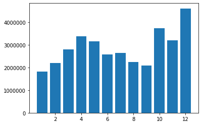
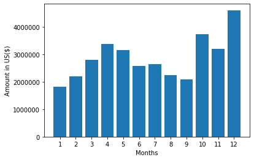
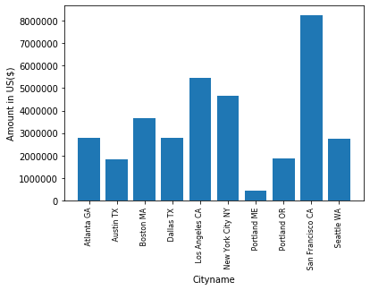
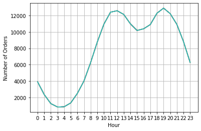
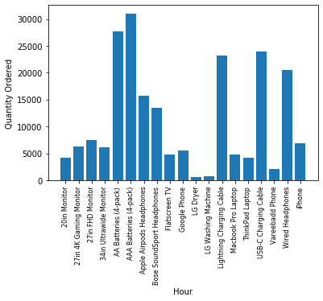

```python
import pandas as pd
import os, glob 
import sympy
```


```python
df = pd.read_csv(r"https://raw.githubusercontent.com/KeithGalli/Pandas-Data-Science-Tasks/master/SalesAnalysis/Sales_Data/Sales_April_2019.csv")
```


```python
df
```


<div>
<style scoped>
    .dataframe tbody tr th:only-of-type {
        vertical-align: middle;
    }

    .dataframe tbody tr th {
        vertical-align: top;
    }

    .dataframe thead th {
        text-align: right;
    }
</style>
<table border="1" class="dataframe">
  <thead>
    <tr style="text-align: right;">
      <th></th>
      <th>Order ID</th>
      <th>Product</th>
      <th>Quantity Ordered</th>
      <th>Price Each</th>
      <th>Order Date</th>
      <th>Purchase Address</th>
    </tr>
  </thead>
  <tbody>
    <tr>
      <td>0</td>
      <td>176558</td>
      <td>USB-C Charging Cable</td>
      <td>2</td>
      <td>11.95</td>
      <td>04/19/19 08:46</td>
      <td>917 1st St, Dallas, TX 75001</td>
    </tr>
    <tr>
      <td>1</td>
      <td>NaN</td>
      <td>NaN</td>
      <td>NaN</td>
      <td>NaN</td>
      <td>NaN</td>
      <td>NaN</td>
    </tr>
    <tr>
      <td>2</td>
      <td>176559</td>
      <td>Bose SoundSport Headphones</td>
      <td>1</td>
      <td>99.99</td>
      <td>04/07/19 22:30</td>
      <td>682 Chestnut St, Boston, MA 02215</td>
    </tr>
    <tr>
      <td>3</td>
      <td>176560</td>
      <td>Google Phone</td>
      <td>1</td>
      <td>600</td>
      <td>04/12/19 14:38</td>
      <td>669 Spruce St, Los Angeles, CA 90001</td>
    </tr>
    <tr>
      <td>4</td>
      <td>176560</td>
      <td>Wired Headphones</td>
      <td>1</td>
      <td>11.99</td>
      <td>04/12/19 14:38</td>
      <td>669 Spruce St, Los Angeles, CA 90001</td>
    </tr>
    <tr>
      <td>...</td>
      <td>...</td>
      <td>...</td>
      <td>...</td>
      <td>...</td>
      <td>...</td>
      <td>...</td>
    </tr>
    <tr>
      <td>18378</td>
      <td>194090</td>
      <td>Google Phone</td>
      <td>1</td>
      <td>600</td>
      <td>04/08/19 17:11</td>
      <td>177 Jackson St, Los Angeles, CA 90001</td>
    </tr>
    <tr>
      <td>18379</td>
      <td>194091</td>
      <td>AA Batteries (4-pack)</td>
      <td>1</td>
      <td>3.84</td>
      <td>04/15/19 16:02</td>
      <td>311 Forest St, Austin, TX 73301</td>
    </tr>
    <tr>
      <td>18380</td>
      <td>194092</td>
      <td>AAA Batteries (4-pack)</td>
      <td>2</td>
      <td>2.99</td>
      <td>04/28/19 14:36</td>
      <td>347 Sunset St, San Francisco, CA 94016</td>
    </tr>
    <tr>
      <td>18381</td>
      <td>194093</td>
      <td>AA Batteries (4-pack)</td>
      <td>1</td>
      <td>3.84</td>
      <td>04/14/19 15:09</td>
      <td>835 Lake St, Portland, OR 97035</td>
    </tr>
    <tr>
      <td>18382</td>
      <td>194094</td>
      <td>Lightning Charging Cable</td>
      <td>1</td>
      <td>14.95</td>
      <td>04/18/19 11:08</td>
      <td>354 North St, Boston, MA 02215</td>
    </tr>
  </tbody>
</table>
<p>18383 rows × 6 columns</p>
</div>


```python
path = "C:/Users/renuka/Downloads/Pandas-Data-Science-Tasks-master/SalesAnalysis/Sales_Data/"
```


```python
all_files = glob.glob(os.path.join(path,"*.csv"))
```


```python
import os, glob

import pandas as pd
# Declare path where all csv files are stored
path = "C:/Users/renuka/Downloads/Pandas-Data-Science-Tasks-master/SalesAnalysis/Sales_Data/"
# Create an array that contains the path to each csv file in directory
all_files = glob.glob(os.path.join(path, "*.csv"))
# df_merged = (pd.read_csv(f, sep=',') for f in all_files)
# df_merged   = pd.concat(all_files, ignore_index=True)

# df_merged.to_csv( "merged.csv")
```


```python
# empty list to store dataframes
li = []

# read each csv file, convert to dataframe using read_csv
# then append dataframe to li
for filename in all_files:
    df = pd.read_csv(filename, index_col=None, header=0)
    li.append(df)
 
# concatenate  multipledataframes along column because axis=0
frame = pd.concat(li, axis=0, ignore_index=True)
```


```python
frame
frame
```


<div>
<style scoped>
    .dataframe tbody tr th:only-of-type {
        vertical-align: middle;
    }

    .dataframe tbody tr th {
        vertical-align: top;
    }

    .dataframe thead th {
        text-align: right;
    }
</style>
<table border="1" class="dataframe">
  <thead>
    <tr style="text-align: right;">
      <th></th>
      <th>Order ID</th>
      <th>Product</th>
      <th>Quantity Ordered</th>
      <th>Price Each</th>
      <th>Order Date</th>
      <th>Purchase Address</th>
    </tr>
  </thead>
  <tbody>
    <tr>
      <td>0</td>
      <td>176558</td>
      <td>USB-C Charging Cable</td>
      <td>2</td>
      <td>11.95</td>
      <td>04/19/19 08:46</td>
      <td>917 1st St, Dallas, TX 75001</td>
    </tr>
    <tr>
      <td>1</td>
      <td>NaN</td>
      <td>NaN</td>
      <td>NaN</td>
      <td>NaN</td>
      <td>NaN</td>
      <td>NaN</td>
    </tr>
    <tr>
      <td>2</td>
      <td>176559</td>
      <td>Bose SoundSport Headphones</td>
      <td>1</td>
      <td>99.99</td>
      <td>04/07/19 22:30</td>
      <td>682 Chestnut St, Boston, MA 02215</td>
    </tr>
    <tr>
      <td>3</td>
      <td>176560</td>
      <td>Google Phone</td>
      <td>1</td>
      <td>600</td>
      <td>04/12/19 14:38</td>
      <td>669 Spruce St, Los Angeles, CA 90001</td>
    </tr>
    <tr>
      <td>4</td>
      <td>176560</td>
      <td>Wired Headphones</td>
      <td>1</td>
      <td>11.99</td>
      <td>04/12/19 14:38</td>
      <td>669 Spruce St, Los Angeles, CA 90001</td>
    </tr>
    <tr>
      <td>...</td>
      <td>...</td>
      <td>...</td>
      <td>...</td>
      <td>...</td>
      <td>...</td>
      <td>...</td>
    </tr>
    <tr>
      <td>186845</td>
      <td>259353</td>
      <td>AAA Batteries (4-pack)</td>
      <td>3</td>
      <td>2.99</td>
      <td>09/17/19 20:56</td>
      <td>840 Highland St, Los Angeles, CA 90001</td>
    </tr>
    <tr>
      <td>186846</td>
      <td>259354</td>
      <td>iPhone</td>
      <td>1</td>
      <td>700</td>
      <td>09/01/19 16:00</td>
      <td>216 Dogwood St, San Francisco, CA 94016</td>
    </tr>
    <tr>
      <td>186847</td>
      <td>259355</td>
      <td>iPhone</td>
      <td>1</td>
      <td>700</td>
      <td>09/23/19 07:39</td>
      <td>220 12th St, San Francisco, CA 94016</td>
    </tr>
    <tr>
      <td>186848</td>
      <td>259356</td>
      <td>34in Ultrawide Monitor</td>
      <td>1</td>
      <td>379.99</td>
      <td>09/19/19 17:30</td>
      <td>511 Forest St, San Francisco, CA 94016</td>
    </tr>
    <tr>
      <td>186849</td>
      <td>259357</td>
      <td>USB-C Charging Cable</td>
      <td>1</td>
      <td>11.95</td>
      <td>09/30/19 00:18</td>
      <td>250 Meadow St, San Francisco, CA 94016</td>
    </tr>
  </tbody>
</table>
<p>186850 rows × 6 columns</p>
</div>


```python
frame.head()
```


<div>
<style scoped>
    .dataframe tbody tr th:only-of-type {
        vertical-align: middle;
    }

    .dataframe tbody tr th {
        vertical-align: top;
    }

    .dataframe thead th {
        text-align: right;
    }
</style>
<table border="1" class="dataframe">
  <thead>
    <tr style="text-align: right;">
      <th></th>
      <th>Order ID</th>
      <th>Product</th>
      <th>Quantity Ordered</th>
      <th>Price Each</th>
      <th>Order Date</th>
      <th>Purchase Address</th>
    </tr>
  </thead>
  <tbody>
    <tr>
      <td>0</td>
      <td>176558</td>
      <td>USB-C Charging Cable</td>
      <td>2</td>
      <td>11.95</td>
      <td>04/19/19 08:46</td>
      <td>917 1st St, Dallas, TX 75001</td>
    </tr>
    <tr>
      <td>1</td>
      <td>NaN</td>
      <td>NaN</td>
      <td>NaN</td>
      <td>NaN</td>
      <td>NaN</td>
      <td>NaN</td>
    </tr>
    <tr>
      <td>2</td>
      <td>176559</td>
      <td>Bose SoundSport Headphones</td>
      <td>1</td>
      <td>99.99</td>
      <td>04/07/19 22:30</td>
      <td>682 Chestnut St, Boston, MA 02215</td>
    </tr>
    <tr>
      <td>3</td>
      <td>176560</td>
      <td>Google Phone</td>
      <td>1</td>
      <td>600</td>
      <td>04/12/19 14:38</td>
      <td>669 Spruce St, Los Angeles, CA 90001</td>
    </tr>
    <tr>
      <td>4</td>
      <td>176560</td>
      <td>Wired Headphones</td>
      <td>1</td>
      <td>11.99</td>
      <td>04/12/19 14:38</td>
      <td>669 Spruce St, Los Angeles, CA 90001</td>
    </tr>
  </tbody>
</table>
</div>


# Data Cleaning


```python
nan= frame[frame.isna().any(axis=1)]
```


```python
nan
```


<div>
<style scoped>
    .dataframe tbody tr th:only-of-type {
        vertical-align: middle;
    }

    .dataframe tbody tr th {
        vertical-align: top;
    }

    .dataframe thead th {
        text-align: right;
    }
</style>
<table border="1" class="dataframe">
  <thead>
    <tr style="text-align: right;">
      <th></th>
      <th>Order ID</th>
      <th>Product</th>
      <th>Quantity Ordered</th>
      <th>Price Each</th>
      <th>Order Date</th>
      <th>Purchase Address</th>
    </tr>
  </thead>
  <tbody>
    <tr>
      <td>1</td>
      <td>NaN</td>
      <td>NaN</td>
      <td>NaN</td>
      <td>NaN</td>
      <td>NaN</td>
      <td>NaN</td>
    </tr>
    <tr>
      <td>356</td>
      <td>NaN</td>
      <td>NaN</td>
      <td>NaN</td>
      <td>NaN</td>
      <td>NaN</td>
      <td>NaN</td>
    </tr>
    <tr>
      <td>735</td>
      <td>NaN</td>
      <td>NaN</td>
      <td>NaN</td>
      <td>NaN</td>
      <td>NaN</td>
      <td>NaN</td>
    </tr>
    <tr>
      <td>1433</td>
      <td>NaN</td>
      <td>NaN</td>
      <td>NaN</td>
      <td>NaN</td>
      <td>NaN</td>
      <td>NaN</td>
    </tr>
    <tr>
      <td>1553</td>
      <td>NaN</td>
      <td>NaN</td>
      <td>NaN</td>
      <td>NaN</td>
      <td>NaN</td>
      <td>NaN</td>
    </tr>
    <tr>
      <td>...</td>
      <td>...</td>
      <td>...</td>
      <td>...</td>
      <td>...</td>
      <td>...</td>
      <td>...</td>
    </tr>
    <tr>
      <td>185176</td>
      <td>NaN</td>
      <td>NaN</td>
      <td>NaN</td>
      <td>NaN</td>
      <td>NaN</td>
      <td>NaN</td>
    </tr>
    <tr>
      <td>185438</td>
      <td>NaN</td>
      <td>NaN</td>
      <td>NaN</td>
      <td>NaN</td>
      <td>NaN</td>
      <td>NaN</td>
    </tr>
    <tr>
      <td>186042</td>
      <td>NaN</td>
      <td>NaN</td>
      <td>NaN</td>
      <td>NaN</td>
      <td>NaN</td>
      <td>NaN</td>
    </tr>
    <tr>
      <td>186548</td>
      <td>NaN</td>
      <td>NaN</td>
      <td>NaN</td>
      <td>NaN</td>
      <td>NaN</td>
      <td>NaN</td>
    </tr>
    <tr>
      <td>186826</td>
      <td>NaN</td>
      <td>NaN</td>
      <td>NaN</td>
      <td>NaN</td>
      <td>NaN</td>
      <td>NaN</td>
    </tr>
  </tbody>
</table>
<p>545 rows × 6 columns</p>
</div>


```python
frame=frame.dropna(how='all')
```


```python
frame
```


<div>
<style scoped>
    .dataframe tbody tr th:only-of-type {
        vertical-align: middle;
    }

    .dataframe tbody tr th {
        vertical-align: top;
    }

    .dataframe thead th {
        text-align: right;
    }
</style>
<table border="1" class="dataframe">
  <thead>
    <tr style="text-align: right;">
      <th></th>
      <th>Order ID</th>
      <th>Product</th>
      <th>Quantity Ordered</th>
      <th>Price Each</th>
      <th>Order Date</th>
      <th>Purchase Address</th>
    </tr>
  </thead>
  <tbody>
    <tr>
      <td>0</td>
      <td>176558</td>
      <td>USB-C Charging Cable</td>
      <td>2</td>
      <td>11.95</td>
      <td>04/19/19 08:46</td>
      <td>917 1st St, Dallas, TX 75001</td>
    </tr>
    <tr>
      <td>2</td>
      <td>176559</td>
      <td>Bose SoundSport Headphones</td>
      <td>1</td>
      <td>99.99</td>
      <td>04/07/19 22:30</td>
      <td>682 Chestnut St, Boston, MA 02215</td>
    </tr>
    <tr>
      <td>3</td>
      <td>176560</td>
      <td>Google Phone</td>
      <td>1</td>
      <td>600</td>
      <td>04/12/19 14:38</td>
      <td>669 Spruce St, Los Angeles, CA 90001</td>
    </tr>
    <tr>
      <td>4</td>
      <td>176560</td>
      <td>Wired Headphones</td>
      <td>1</td>
      <td>11.99</td>
      <td>04/12/19 14:38</td>
      <td>669 Spruce St, Los Angeles, CA 90001</td>
    </tr>
    <tr>
      <td>5</td>
      <td>176561</td>
      <td>Wired Headphones</td>
      <td>1</td>
      <td>11.99</td>
      <td>04/30/19 09:27</td>
      <td>333 8th St, Los Angeles, CA 90001</td>
    </tr>
    <tr>
      <td>...</td>
      <td>...</td>
      <td>...</td>
      <td>...</td>
      <td>...</td>
      <td>...</td>
      <td>...</td>
    </tr>
    <tr>
      <td>186845</td>
      <td>259353</td>
      <td>AAA Batteries (4-pack)</td>
      <td>3</td>
      <td>2.99</td>
      <td>09/17/19 20:56</td>
      <td>840 Highland St, Los Angeles, CA 90001</td>
    </tr>
    <tr>
      <td>186846</td>
      <td>259354</td>
      <td>iPhone</td>
      <td>1</td>
      <td>700</td>
      <td>09/01/19 16:00</td>
      <td>216 Dogwood St, San Francisco, CA 94016</td>
    </tr>
    <tr>
      <td>186847</td>
      <td>259355</td>
      <td>iPhone</td>
      <td>1</td>
      <td>700</td>
      <td>09/23/19 07:39</td>
      <td>220 12th St, San Francisco, CA 94016</td>
    </tr>
    <tr>
      <td>186848</td>
      <td>259356</td>
      <td>34in Ultrawide Monitor</td>
      <td>1</td>
      <td>379.99</td>
      <td>09/19/19 17:30</td>
      <td>511 Forest St, San Francisco, CA 94016</td>
    </tr>
    <tr>
      <td>186849</td>
      <td>259357</td>
      <td>USB-C Charging Cable</td>
      <td>1</td>
      <td>11.95</td>
      <td>09/30/19 00:18</td>
      <td>250 Meadow St, San Francisco, CA 94016</td>
    </tr>
  </tbody>
</table>
<p>186305 rows × 6 columns</p>
</div>


```python
#remove erroneous values
frame=frame[frame['Order Date'].str[0:2]!='Or']
```

temp_frame


```python
temp_frame.head()
```


    ---------------------------------------------------------------------------

    NameError                                 Traceback (most recent call last)

    <ipython-input-44-24590ddd9ad5> in <module>
    ----> 1 temp_frame.head()
    

    NameError: name 'temp_frame' is not defined


```python
frame.head()
```


<div>
<style scoped>
    .dataframe tbody tr th:only-of-type {
        vertical-align: middle;
    }

    .dataframe tbody tr th {
        vertical-align: top;
    }

    .dataframe thead th {
        text-align: right;
    }
</style>
<table border="1" class="dataframe">
  <thead>
    <tr style="text-align: right;">
      <th></th>
      <th>Order ID</th>
      <th>Product</th>
      <th>Quantity Ordered</th>
      <th>Price Each</th>
      <th>Order Date</th>
      <th>Purchase Address</th>
    </tr>
  </thead>
  <tbody>
    <tr>
      <td>0</td>
      <td>176558</td>
      <td>USB-C Charging Cable</td>
      <td>2</td>
      <td>11.95</td>
      <td>04/19/19 08:46</td>
      <td>917 1st St, Dallas, TX 75001</td>
    </tr>
    <tr>
      <td>2</td>
      <td>176559</td>
      <td>Bose SoundSport Headphones</td>
      <td>1</td>
      <td>99.99</td>
      <td>04/07/19 22:30</td>
      <td>682 Chestnut St, Boston, MA 02215</td>
    </tr>
    <tr>
      <td>3</td>
      <td>176560</td>
      <td>Google Phone</td>
      <td>1</td>
      <td>600</td>
      <td>04/12/19 14:38</td>
      <td>669 Spruce St, Los Angeles, CA 90001</td>
    </tr>
    <tr>
      <td>4</td>
      <td>176560</td>
      <td>Wired Headphones</td>
      <td>1</td>
      <td>11.99</td>
      <td>04/12/19 14:38</td>
      <td>669 Spruce St, Los Angeles, CA 90001</td>
    </tr>
    <tr>
      <td>5</td>
      <td>176561</td>
      <td>Wired Headphones</td>
      <td>1</td>
      <td>11.99</td>
      <td>04/30/19 09:27</td>
      <td>333 8th St, Los Angeles, CA 90001</td>
    </tr>
  </tbody>
</table>
</div>


```python
frame['Month']=frame['Order Date'].str[0:2]
```


```python
frame['Month']=frame['Order Date'].str[0:2]
```


```python
frame
```


<div>
<style scoped>
    .dataframe tbody tr th:only-of-type {
        vertical-align: middle;
    }

    .dataframe tbody tr th {
        vertical-align: top;
    }

    .dataframe thead th {
        text-align: right;
    }
</style>
<table border="1" class="dataframe">
  <thead>
    <tr style="text-align: right;">
      <th></th>
      <th>Order ID</th>
      <th>Product</th>
      <th>Quantity Ordered</th>
      <th>Price Each</th>
      <th>Order Date</th>
      <th>Purchase Address</th>
      <th>Month</th>
    </tr>
  </thead>
  <tbody>
    <tr>
      <td>0</td>
      <td>176558</td>
      <td>USB-C Charging Cable</td>
      <td>2</td>
      <td>11.95</td>
      <td>04/19/19 08:46</td>
      <td>917 1st St, Dallas, TX 75001</td>
      <td>04</td>
    </tr>
    <tr>
      <td>2</td>
      <td>176559</td>
      <td>Bose SoundSport Headphones</td>
      <td>1</td>
      <td>99.99</td>
      <td>04/07/19 22:30</td>
      <td>682 Chestnut St, Boston, MA 02215</td>
      <td>04</td>
    </tr>
    <tr>
      <td>3</td>
      <td>176560</td>
      <td>Google Phone</td>
      <td>1</td>
      <td>600</td>
      <td>04/12/19 14:38</td>
      <td>669 Spruce St, Los Angeles, CA 90001</td>
      <td>04</td>
    </tr>
    <tr>
      <td>4</td>
      <td>176560</td>
      <td>Wired Headphones</td>
      <td>1</td>
      <td>11.99</td>
      <td>04/12/19 14:38</td>
      <td>669 Spruce St, Los Angeles, CA 90001</td>
      <td>04</td>
    </tr>
    <tr>
      <td>5</td>
      <td>176561</td>
      <td>Wired Headphones</td>
      <td>1</td>
      <td>11.99</td>
      <td>04/30/19 09:27</td>
      <td>333 8th St, Los Angeles, CA 90001</td>
      <td>04</td>
    </tr>
    <tr>
      <td>...</td>
      <td>...</td>
      <td>...</td>
      <td>...</td>
      <td>...</td>
      <td>...</td>
      <td>...</td>
      <td>...</td>
    </tr>
    <tr>
      <td>186845</td>
      <td>259353</td>
      <td>AAA Batteries (4-pack)</td>
      <td>3</td>
      <td>2.99</td>
      <td>09/17/19 20:56</td>
      <td>840 Highland St, Los Angeles, CA 90001</td>
      <td>09</td>
    </tr>
    <tr>
      <td>186846</td>
      <td>259354</td>
      <td>iPhone</td>
      <td>1</td>
      <td>700</td>
      <td>09/01/19 16:00</td>
      <td>216 Dogwood St, San Francisco, CA 94016</td>
      <td>09</td>
    </tr>
    <tr>
      <td>186847</td>
      <td>259355</td>
      <td>iPhone</td>
      <td>1</td>
      <td>700</td>
      <td>09/23/19 07:39</td>
      <td>220 12th St, San Francisco, CA 94016</td>
      <td>09</td>
    </tr>
    <tr>
      <td>186848</td>
      <td>259356</td>
      <td>34in Ultrawide Monitor</td>
      <td>1</td>
      <td>379.99</td>
      <td>09/19/19 17:30</td>
      <td>511 Forest St, San Francisco, CA 94016</td>
      <td>09</td>
    </tr>
    <tr>
      <td>186849</td>
      <td>259357</td>
      <td>USB-C Charging Cable</td>
      <td>1</td>
      <td>11.95</td>
      <td>09/30/19 00:18</td>
      <td>250 Meadow St, San Francisco, CA 94016</td>
      <td>09</td>
    </tr>
  </tbody>
</table>
<p>185950 rows × 7 columns</p>
</div>


```python
frame=frame[frame['Order Date'].str[0:2]!='Or']
```


```python
frame['Month']=frame['Month'].astype('int32')
```


```python
#convert data quantity to int
frame['Quantity Ordered']=pd.to_numeric(frame['Quantity Ordered'])
```


```python
frame['Price Each']=pd.to_numeric(frame['Price Each'])
```


```python
frame
```


<div>
<style scoped>
    .dataframe tbody tr th:only-of-type {
        vertical-align: middle;
    }

    .dataframe tbody tr th {
        vertical-align: top;
    }

    .dataframe thead th {
        text-align: right;
    }
</style>
<table border="1" class="dataframe">
  <thead>
    <tr style="text-align: right;">
      <th></th>
      <th>Order ID</th>
      <th>Product</th>
      <th>Quantity Ordered</th>
      <th>Price Each</th>
      <th>Order Date</th>
      <th>Purchase Address</th>
      <th>Month</th>
      <th>Sales</th>
    </tr>
  </thead>
  <tbody>
    <tr>
      <td>0</td>
      <td>176558</td>
      <td>USB-C Charging Cable</td>
      <td>2</td>
      <td>11.95</td>
      <td>04/19/19 08:46</td>
      <td>917 1st St, Dallas, TX 75001</td>
      <td>4</td>
      <td>23.90</td>
    </tr>
    <tr>
      <td>2</td>
      <td>176559</td>
      <td>Bose SoundSport Headphones</td>
      <td>1</td>
      <td>99.99</td>
      <td>04/07/19 22:30</td>
      <td>682 Chestnut St, Boston, MA 02215</td>
      <td>4</td>
      <td>99.99</td>
    </tr>
    <tr>
      <td>3</td>
      <td>176560</td>
      <td>Google Phone</td>
      <td>1</td>
      <td>600.00</td>
      <td>04/12/19 14:38</td>
      <td>669 Spruce St, Los Angeles, CA 90001</td>
      <td>4</td>
      <td>600.00</td>
    </tr>
    <tr>
      <td>4</td>
      <td>176560</td>
      <td>Wired Headphones</td>
      <td>1</td>
      <td>11.99</td>
      <td>04/12/19 14:38</td>
      <td>669 Spruce St, Los Angeles, CA 90001</td>
      <td>4</td>
      <td>11.99</td>
    </tr>
    <tr>
      <td>5</td>
      <td>176561</td>
      <td>Wired Headphones</td>
      <td>1</td>
      <td>11.99</td>
      <td>04/30/19 09:27</td>
      <td>333 8th St, Los Angeles, CA 90001</td>
      <td>4</td>
      <td>11.99</td>
    </tr>
    <tr>
      <td>...</td>
      <td>...</td>
      <td>...</td>
      <td>...</td>
      <td>...</td>
      <td>...</td>
      <td>...</td>
      <td>...</td>
      <td>...</td>
    </tr>
    <tr>
      <td>186845</td>
      <td>259353</td>
      <td>AAA Batteries (4-pack)</td>
      <td>3</td>
      <td>2.99</td>
      <td>09/17/19 20:56</td>
      <td>840 Highland St, Los Angeles, CA 90001</td>
      <td>9</td>
      <td>8.97</td>
    </tr>
    <tr>
      <td>186846</td>
      <td>259354</td>
      <td>iPhone</td>
      <td>1</td>
      <td>700.00</td>
      <td>09/01/19 16:00</td>
      <td>216 Dogwood St, San Francisco, CA 94016</td>
      <td>9</td>
      <td>700.00</td>
    </tr>
    <tr>
      <td>186847</td>
      <td>259355</td>
      <td>iPhone</td>
      <td>1</td>
      <td>700.00</td>
      <td>09/23/19 07:39</td>
      <td>220 12th St, San Francisco, CA 94016</td>
      <td>9</td>
      <td>700.00</td>
    </tr>
    <tr>
      <td>186848</td>
      <td>259356</td>
      <td>34in Ultrawide Monitor</td>
      <td>1</td>
      <td>379.99</td>
      <td>09/19/19 17:30</td>
      <td>511 Forest St, San Francisco, CA 94016</td>
      <td>9</td>
      <td>379.99</td>
    </tr>
    <tr>
      <td>186849</td>
      <td>259357</td>
      <td>USB-C Charging Cable</td>
      <td>1</td>
      <td>11.95</td>
      <td>09/30/19 00:18</td>
      <td>250 Meadow St, San Francisco, CA 94016</td>
      <td>9</td>
      <td>11.95</td>
    </tr>
  </tbody>
</table>
<p>185950 rows × 8 columns</p>
</div>


x


```python
frame['Sales']=frame['Quantity Ordered']* frame['Price Each']
frame
```


<div>
<style scoped>
    .dataframe tbody tr th:only-of-type {
        vertical-align: middle;
    }

    .dataframe tbody tr th {
        vertical-align: top;
    }

    .dataframe thead th {
        text-align: right;
    }
</style>
<table border="1" class="dataframe">
  <thead>
    <tr style="text-align: right;">
      <th></th>
      <th>Order ID</th>
      <th>Product</th>
      <th>Quantity Ordered</th>
      <th>Price Each</th>
      <th>Order Date</th>
      <th>Purchase Address</th>
      <th>Month</th>
      <th>Sales</th>
    </tr>
  </thead>
  <tbody>
    <tr>
      <td>0</td>
      <td>176558</td>
      <td>USB-C Charging Cable</td>
      <td>2</td>
      <td>11.95</td>
      <td>04/19/19 08:46</td>
      <td>917 1st St, Dallas, TX 75001</td>
      <td>4</td>
      <td>23.90</td>
    </tr>
    <tr>
      <td>2</td>
      <td>176559</td>
      <td>Bose SoundSport Headphones</td>
      <td>1</td>
      <td>99.99</td>
      <td>04/07/19 22:30</td>
      <td>682 Chestnut St, Boston, MA 02215</td>
      <td>4</td>
      <td>99.99</td>
    </tr>
    <tr>
      <td>3</td>
      <td>176560</td>
      <td>Google Phone</td>
      <td>1</td>
      <td>600.00</td>
      <td>04/12/19 14:38</td>
      <td>669 Spruce St, Los Angeles, CA 90001</td>
      <td>4</td>
      <td>600.00</td>
    </tr>
    <tr>
      <td>4</td>
      <td>176560</td>
      <td>Wired Headphones</td>
      <td>1</td>
      <td>11.99</td>
      <td>04/12/19 14:38</td>
      <td>669 Spruce St, Los Angeles, CA 90001</td>
      <td>4</td>
      <td>11.99</td>
    </tr>
    <tr>
      <td>5</td>
      <td>176561</td>
      <td>Wired Headphones</td>
      <td>1</td>
      <td>11.99</td>
      <td>04/30/19 09:27</td>
      <td>333 8th St, Los Angeles, CA 90001</td>
      <td>4</td>
      <td>11.99</td>
    </tr>
    <tr>
      <td>...</td>
      <td>...</td>
      <td>...</td>
      <td>...</td>
      <td>...</td>
      <td>...</td>
      <td>...</td>
      <td>...</td>
      <td>...</td>
    </tr>
    <tr>
      <td>186845</td>
      <td>259353</td>
      <td>AAA Batteries (4-pack)</td>
      <td>3</td>
      <td>2.99</td>
      <td>09/17/19 20:56</td>
      <td>840 Highland St, Los Angeles, CA 90001</td>
      <td>9</td>
      <td>8.97</td>
    </tr>
    <tr>
      <td>186846</td>
      <td>259354</td>
      <td>iPhone</td>
      <td>1</td>
      <td>700.00</td>
      <td>09/01/19 16:00</td>
      <td>216 Dogwood St, San Francisco, CA 94016</td>
      <td>9</td>
      <td>700.00</td>
    </tr>
    <tr>
      <td>186847</td>
      <td>259355</td>
      <td>iPhone</td>
      <td>1</td>
      <td>700.00</td>
      <td>09/23/19 07:39</td>
      <td>220 12th St, San Francisco, CA 94016</td>
      <td>9</td>
      <td>700.00</td>
    </tr>
    <tr>
      <td>186848</td>
      <td>259356</td>
      <td>34in Ultrawide Monitor</td>
      <td>1</td>
      <td>379.99</td>
      <td>09/19/19 17:30</td>
      <td>511 Forest St, San Francisco, CA 94016</td>
      <td>9</td>
      <td>379.99</td>
    </tr>
    <tr>
      <td>186849</td>
      <td>259357</td>
      <td>USB-C Charging Cable</td>
      <td>1</td>
      <td>11.95</td>
      <td>09/30/19 00:18</td>
      <td>250 Meadow St, San Francisco, CA 94016</td>
      <td>9</td>
      <td>11.95</td>
    </tr>
  </tbody>
</table>
<p>185950 rows × 8 columns</p>
</div>


```python
def get_city(address):
       return address.split(',')[1]
    
def get_state(address):
       return address.split(',')[2].split(' ')[1]
```


```python
frame['City']=frame['Purchase Address'].apply(lambda x: get_city(x) +' '+ get_state(x))
```


```python
frame.head()
```


<div>
<style scoped>
    .dataframe tbody tr th:only-of-type {
        vertical-align: middle;
    }

    .dataframe tbody tr th {
        vertical-align: top;
    }

    .dataframe thead th {
        text-align: right;
    }
</style>
<table border="1" class="dataframe">
  <thead>
    <tr style="text-align: right;">
      <th></th>
      <th>Order ID</th>
      <th>Product</th>
      <th>Quantity Ordered</th>
      <th>Price Each</th>
      <th>Order Date</th>
      <th>Purchase Address</th>
      <th>Month</th>
      <th>Sales</th>
      <th>City</th>
    </tr>
  </thead>
  <tbody>
    <tr>
      <td>0</td>
      <td>176558</td>
      <td>USB-C Charging Cable</td>
      <td>2</td>
      <td>11.95</td>
      <td>04/19/19 08:46</td>
      <td>917 1st St, Dallas, TX 75001</td>
      <td>4</td>
      <td>23.90</td>
      <td>Dallas TX</td>
    </tr>
    <tr>
      <td>2</td>
      <td>176559</td>
      <td>Bose SoundSport Headphones</td>
      <td>1</td>
      <td>99.99</td>
      <td>04/07/19 22:30</td>
      <td>682 Chestnut St, Boston, MA 02215</td>
      <td>4</td>
      <td>99.99</td>
      <td>Boston MA</td>
    </tr>
    <tr>
      <td>3</td>
      <td>176560</td>
      <td>Google Phone</td>
      <td>1</td>
      <td>600.00</td>
      <td>04/12/19 14:38</td>
      <td>669 Spruce St, Los Angeles, CA 90001</td>
      <td>4</td>
      <td>600.00</td>
      <td>Los Angeles CA</td>
    </tr>
    <tr>
      <td>4</td>
      <td>176560</td>
      <td>Wired Headphones</td>
      <td>1</td>
      <td>11.99</td>
      <td>04/12/19 14:38</td>
      <td>669 Spruce St, Los Angeles, CA 90001</td>
      <td>4</td>
      <td>11.99</td>
      <td>Los Angeles CA</td>
    </tr>
    <tr>
      <td>5</td>
      <td>176561</td>
      <td>Wired Headphones</td>
      <td>1</td>
      <td>11.99</td>
      <td>04/30/19 09:27</td>
      <td>333 8th St, Los Angeles, CA 90001</td>
      <td>4</td>
      <td>11.99</td>
      <td>Los Angeles CA</td>
    </tr>
  </tbody>
</table>
</div>


```python
frame.head()
```


<div>
<style scoped>
    .dataframe tbody tr th:only-of-type {
        vertical-align: middle;
    }

    .dataframe tbody tr th {
        vertical-align: top;
    }

    .dataframe thead th {
        text-align: right;
    }
</style>
<table border="1" class="dataframe">
  <thead>
    <tr style="text-align: right;">
      <th></th>
      <th>Order ID</th>
      <th>Product</th>
      <th>Quantity Ordered</th>
      <th>Price Each</th>
      <th>Order Date</th>
      <th>Purchase Address</th>
      <th>Month</th>
      <th>Sales</th>
      <th>City</th>
    </tr>
  </thead>
  <tbody>
    <tr>
      <td>0</td>
      <td>176558</td>
      <td>USB-C Charging Cable</td>
      <td>2</td>
      <td>11.95</td>
      <td>04/19/19 08:46</td>
      <td>917 1st St, Dallas, TX 75001</td>
      <td>4</td>
      <td>23.90</td>
      <td>Dallas  TX 75001</td>
    </tr>
    <tr>
      <td>2</td>
      <td>176559</td>
      <td>Bose SoundSport Headphones</td>
      <td>1</td>
      <td>99.99</td>
      <td>04/07/19 22:30</td>
      <td>682 Chestnut St, Boston, MA 02215</td>
      <td>4</td>
      <td>99.99</td>
      <td>Boston  MA 02215</td>
    </tr>
    <tr>
      <td>3</td>
      <td>176560</td>
      <td>Google Phone</td>
      <td>1</td>
      <td>600.00</td>
      <td>04/12/19 14:38</td>
      <td>669 Spruce St, Los Angeles, CA 90001</td>
      <td>4</td>
      <td>600.00</td>
      <td>Los Angeles  CA 90001</td>
    </tr>
    <tr>
      <td>4</td>
      <td>176560</td>
      <td>Wired Headphones</td>
      <td>1</td>
      <td>11.99</td>
      <td>04/12/19 14:38</td>
      <td>669 Spruce St, Los Angeles, CA 90001</td>
      <td>4</td>
      <td>11.99</td>
      <td>Los Angeles  CA 90001</td>
    </tr>
    <tr>
      <td>5</td>
      <td>176561</td>
      <td>Wired Headphones</td>
      <td>1</td>
      <td>11.99</td>
      <td>04/30/19 09:27</td>
      <td>333 8th St, Los Angeles, CA 90001</td>
      <td>4</td>
      <td>11.99</td>
      <td>Los Angeles  CA 90001</td>
    </tr>
  </tbody>
</table>
</div>


# What was the best month for sales?
#Augment data with additional columns


```python
results=frame.groupby('Month').sum()
```


```python
frame.groupby('Month').sum()
```


<div>
<style scoped>
    .dataframe tbody tr th:only-of-type {
        vertical-align: middle;
    }

    .dataframe tbody tr th {
        vertical-align: top;
    }

    .dataframe thead th {
        text-align: right;
    }
</style>
<table border="1" class="dataframe">
  <thead>
    <tr style="text-align: right;">
      <th></th>
      <th>Quantity Ordered</th>
      <th>Price Each</th>
      <th>Sales</th>
    </tr>
    <tr>
      <th>Month</th>
      <th></th>
      <th></th>
      <th></th>
    </tr>
  </thead>
  <tbody>
    <tr>
      <td>1</td>
      <td>10903</td>
      <td>1.811768e+06</td>
      <td>1.822257e+06</td>
    </tr>
    <tr>
      <td>2</td>
      <td>13449</td>
      <td>2.188885e+06</td>
      <td>2.202022e+06</td>
    </tr>
    <tr>
      <td>3</td>
      <td>17005</td>
      <td>2.791208e+06</td>
      <td>2.807100e+06</td>
    </tr>
    <tr>
      <td>4</td>
      <td>20558</td>
      <td>3.367671e+06</td>
      <td>3.390670e+06</td>
    </tr>
    <tr>
      <td>5</td>
      <td>18667</td>
      <td>3.135125e+06</td>
      <td>3.152607e+06</td>
    </tr>
    <tr>
      <td>6</td>
      <td>15253</td>
      <td>2.562026e+06</td>
      <td>2.577802e+06</td>
    </tr>
    <tr>
      <td>7</td>
      <td>16072</td>
      <td>2.632540e+06</td>
      <td>2.647776e+06</td>
    </tr>
    <tr>
      <td>8</td>
      <td>13448</td>
      <td>2.230345e+06</td>
      <td>2.244468e+06</td>
    </tr>
    <tr>
      <td>9</td>
      <td>13109</td>
      <td>2.084992e+06</td>
      <td>2.097560e+06</td>
    </tr>
    <tr>
      <td>10</td>
      <td>22703</td>
      <td>3.715555e+06</td>
      <td>3.736727e+06</td>
    </tr>
    <tr>
      <td>11</td>
      <td>19798</td>
      <td>3.180601e+06</td>
      <td>3.199603e+06</td>
    </tr>
    <tr>
      <td>12</td>
      <td>28114</td>
      <td>4.588415e+06</td>
      <td>4.613443e+06</td>
    </tr>
  </tbody>
</table>
</div>


```python
import matplotlib.pyplot as plt
months= range(1,13)
plt.bar(months, results['Sales'])
```


    <BarContainer object of 12 artists>


```python
plt.show
```


    <function matplotlib.pyplot.show(*args, **kw)>


```python
plt.show()
```


```python
results=frame.groupby('Month').sum()
```


```python
import matplotlib.pyplot as plt
months= range(1,13)
plt.bar(months, results['Sales'])
```


    <BarContainer object of 12 artists>





```python
results=frame.groupby('Month').sum()
import matplotlib.pyplot as plt
months= range(1,13)
plt.bar(months, results['Sales'])
plt.xticks(months)
plt.ylabel('Amount in US($)')
plt.xlabel('Months')
plt.show()
```





# Which city had the highest number of sales?


```python
results=frame.groupby('City').sum()
```


```python
results
```


<div>
<style scoped>
    .dataframe tbody tr th:only-of-type {
        vertical-align: middle;
    }

    .dataframe tbody tr th {
        vertical-align: top;
    }

    .dataframe thead th {
        text-align: right;
    }
</style>
<table border="1" class="dataframe">
  <thead>
    <tr style="text-align: right;">
      <th></th>
      <th>Quantity Ordered</th>
      <th>Price Each</th>
      <th>Month</th>
      <th>Sales</th>
    </tr>
    <tr>
      <th>City</th>
      <th></th>
      <th></th>
      <th></th>
      <th></th>
    </tr>
  </thead>
  <tbody>
    <tr>
      <td>Atlanta GA</td>
      <td>16602</td>
      <td>2.779908e+06</td>
      <td>104794</td>
      <td>2.795499e+06</td>
    </tr>
    <tr>
      <td>Austin TX</td>
      <td>11153</td>
      <td>1.809874e+06</td>
      <td>69829</td>
      <td>1.819582e+06</td>
    </tr>
    <tr>
      <td>Boston MA</td>
      <td>22528</td>
      <td>3.637410e+06</td>
      <td>141112</td>
      <td>3.661642e+06</td>
    </tr>
    <tr>
      <td>Dallas TX</td>
      <td>16730</td>
      <td>2.752628e+06</td>
      <td>104620</td>
      <td>2.767975e+06</td>
    </tr>
    <tr>
      <td>Los Angeles CA</td>
      <td>33289</td>
      <td>5.421435e+06</td>
      <td>208325</td>
      <td>5.452571e+06</td>
    </tr>
    <tr>
      <td>New York City NY</td>
      <td>27932</td>
      <td>4.635371e+06</td>
      <td>175741</td>
      <td>4.664317e+06</td>
    </tr>
    <tr>
      <td>Portland ME</td>
      <td>2750</td>
      <td>4.471893e+05</td>
      <td>17144</td>
      <td>4.497583e+05</td>
    </tr>
    <tr>
      <td>Portland OR</td>
      <td>11303</td>
      <td>1.860558e+06</td>
      <td>70621</td>
      <td>1.870732e+06</td>
    </tr>
    <tr>
      <td>San Francisco CA</td>
      <td>50239</td>
      <td>8.211462e+06</td>
      <td>315520</td>
      <td>8.262204e+06</td>
    </tr>
    <tr>
      <td>Seattle WA</td>
      <td>16553</td>
      <td>2.733296e+06</td>
      <td>104941</td>
      <td>2.747755e+06</td>
    </tr>
  </tbody>
</table>
</div>


```python

import matplotlib.pyplot as plt

cities = [city for city, df in frame .groupby('City')]


plt.bar(cities, results['Sales'])
plt.xticks(cities, rotation = 'vertical', size= 8)
plt.ylabel('Amount in US($)')
plt.xlabel('Cityname')
plt.show()
```





```python
frame['Order Date']= pd.to_datetime(frame['Order Date'])
```


```python
frame['Hour']= frame['Order Date'].dt.hour
```


```python
frame['Minute']= frame['Order Date'].dt.hour
```


```python
frame
```


<div>
<style scoped>
    .dataframe tbody tr th:only-of-type {
        vertical-align: middle;
    }

    .dataframe tbody tr th {
        vertical-align: top;
    }

    .dataframe thead th {
        text-align: right;
    }
</style>
<table border="1" class="dataframe">
  <thead>
    <tr style="text-align: right;">
      <th></th>
      <th>Order ID</th>
      <th>Product</th>
      <th>Quantity Ordered</th>
      <th>Price Each</th>
      <th>Order Date</th>
      <th>Purchase Address</th>
      <th>Month</th>
      <th>Sales</th>
      <th>City</th>
      <th>Hour</th>
      <th>Minute</th>
    </tr>
  </thead>
  <tbody>
    <tr>
      <td>0</td>
      <td>176558</td>
      <td>USB-C Charging Cable</td>
      <td>2</td>
      <td>11.95</td>
      <td>2019-04-19 08:46:00</td>
      <td>917 1st St, Dallas, TX 75001</td>
      <td>4</td>
      <td>23.90</td>
      <td>Dallas TX</td>
      <td>8</td>
      <td>8</td>
    </tr>
    <tr>
      <td>2</td>
      <td>176559</td>
      <td>Bose SoundSport Headphones</td>
      <td>1</td>
      <td>99.99</td>
      <td>2019-04-07 22:30:00</td>
      <td>682 Chestnut St, Boston, MA 02215</td>
      <td>4</td>
      <td>99.99</td>
      <td>Boston MA</td>
      <td>22</td>
      <td>22</td>
    </tr>
    <tr>
      <td>3</td>
      <td>176560</td>
      <td>Google Phone</td>
      <td>1</td>
      <td>600.00</td>
      <td>2019-04-12 14:38:00</td>
      <td>669 Spruce St, Los Angeles, CA 90001</td>
      <td>4</td>
      <td>600.00</td>
      <td>Los Angeles CA</td>
      <td>14</td>
      <td>14</td>
    </tr>
    <tr>
      <td>4</td>
      <td>176560</td>
      <td>Wired Headphones</td>
      <td>1</td>
      <td>11.99</td>
      <td>2019-04-12 14:38:00</td>
      <td>669 Spruce St, Los Angeles, CA 90001</td>
      <td>4</td>
      <td>11.99</td>
      <td>Los Angeles CA</td>
      <td>14</td>
      <td>14</td>
    </tr>
    <tr>
      <td>5</td>
      <td>176561</td>
      <td>Wired Headphones</td>
      <td>1</td>
      <td>11.99</td>
      <td>2019-04-30 09:27:00</td>
      <td>333 8th St, Los Angeles, CA 90001</td>
      <td>4</td>
      <td>11.99</td>
      <td>Los Angeles CA</td>
      <td>9</td>
      <td>9</td>
    </tr>
    <tr>
      <td>...</td>
      <td>...</td>
      <td>...</td>
      <td>...</td>
      <td>...</td>
      <td>...</td>
      <td>...</td>
      <td>...</td>
      <td>...</td>
      <td>...</td>
      <td>...</td>
      <td>...</td>
    </tr>
    <tr>
      <td>186845</td>
      <td>259353</td>
      <td>AAA Batteries (4-pack)</td>
      <td>3</td>
      <td>2.99</td>
      <td>2019-09-17 20:56:00</td>
      <td>840 Highland St, Los Angeles, CA 90001</td>
      <td>9</td>
      <td>8.97</td>
      <td>Los Angeles CA</td>
      <td>20</td>
      <td>20</td>
    </tr>
    <tr>
      <td>186846</td>
      <td>259354</td>
      <td>iPhone</td>
      <td>1</td>
      <td>700.00</td>
      <td>2019-09-01 16:00:00</td>
      <td>216 Dogwood St, San Francisco, CA 94016</td>
      <td>9</td>
      <td>700.00</td>
      <td>San Francisco CA</td>
      <td>16</td>
      <td>16</td>
    </tr>
    <tr>
      <td>186847</td>
      <td>259355</td>
      <td>iPhone</td>
      <td>1</td>
      <td>700.00</td>
      <td>2019-09-23 07:39:00</td>
      <td>220 12th St, San Francisco, CA 94016</td>
      <td>9</td>
      <td>700.00</td>
      <td>San Francisco CA</td>
      <td>7</td>
      <td>7</td>
    </tr>
    <tr>
      <td>186848</td>
      <td>259356</td>
      <td>34in Ultrawide Monitor</td>
      <td>1</td>
      <td>379.99</td>
      <td>2019-09-19 17:30:00</td>
      <td>511 Forest St, San Francisco, CA 94016</td>
      <td>9</td>
      <td>379.99</td>
      <td>San Francisco CA</td>
      <td>17</td>
      <td>17</td>
    </tr>
    <tr>
      <td>186849</td>
      <td>259357</td>
      <td>USB-C Charging Cable</td>
      <td>1</td>
      <td>11.95</td>
      <td>2019-09-30 00:18:00</td>
      <td>250 Meadow St, San Francisco, CA 94016</td>
      <td>9</td>
      <td>11.95</td>
      <td>San Francisco CA</td>
      <td>0</td>
      <td>0</td>
    </tr>
  </tbody>
</table>
<p>185950 rows × 11 columns</p>
</div>


# What time should you place ads?


```python
hours= [hour for hour, df in frame .groupby('Hour')]
plt.plot(hours, frame.groupby(['Hour']).count())
plt.xticks(hours)
plt.xlabel('Hour')
plt.ylabel('Number of Orders')
plt.grid()
plt.show()
```





```python
# My recommendation is 11am and 7 am

```


```python
df= frame[frame['Order ID'].duplicated (keep=False)]
```


```python
df.head()
```


<div>
<style scoped>
    .dataframe tbody tr th:only-of-type {
        vertical-align: middle;
    }

    .dataframe tbody tr th {
        vertical-align: top;
    }

    .dataframe thead th {
        text-align: right;
    }
</style>
<table border="1" class="dataframe">
  <thead>
    <tr style="text-align: right;">
      <th></th>
      <th>Order ID</th>
      <th>Product</th>
      <th>Quantity Ordered</th>
      <th>Price Each</th>
      <th>Order Date</th>
      <th>Purchase Address</th>
      <th>Month</th>
      <th>Sales</th>
      <th>City</th>
      <th>Hour</th>
      <th>Minute</th>
    </tr>
  </thead>
  <tbody>
    <tr>
      <td>3</td>
      <td>176560</td>
      <td>Google Phone</td>
      <td>1</td>
      <td>600.00</td>
      <td>2019-04-12 14:38:00</td>
      <td>669 Spruce St, Los Angeles, CA 90001</td>
      <td>4</td>
      <td>600.00</td>
      <td>Los Angeles CA</td>
      <td>14</td>
      <td>14</td>
    </tr>
    <tr>
      <td>4</td>
      <td>176560</td>
      <td>Wired Headphones</td>
      <td>1</td>
      <td>11.99</td>
      <td>2019-04-12 14:38:00</td>
      <td>669 Spruce St, Los Angeles, CA 90001</td>
      <td>4</td>
      <td>11.99</td>
      <td>Los Angeles CA</td>
      <td>14</td>
      <td>14</td>
    </tr>
    <tr>
      <td>18</td>
      <td>176574</td>
      <td>Google Phone</td>
      <td>1</td>
      <td>600.00</td>
      <td>2019-04-03 19:42:00</td>
      <td>20 Hill St, Los Angeles, CA 90001</td>
      <td>4</td>
      <td>600.00</td>
      <td>Los Angeles CA</td>
      <td>19</td>
      <td>19</td>
    </tr>
    <tr>
      <td>19</td>
      <td>176574</td>
      <td>USB-C Charging Cable</td>
      <td>1</td>
      <td>11.95</td>
      <td>2019-04-03 19:42:00</td>
      <td>20 Hill St, Los Angeles, CA 90001</td>
      <td>4</td>
      <td>11.95</td>
      <td>Los Angeles CA</td>
      <td>19</td>
      <td>19</td>
    </tr>
    <tr>
      <td>30</td>
      <td>176585</td>
      <td>Bose SoundSport Headphones</td>
      <td>1</td>
      <td>99.99</td>
      <td>2019-04-07 11:31:00</td>
      <td>823 Highland St, Boston, MA 02215</td>
      <td>4</td>
      <td>99.99</td>
      <td>Boston MA</td>
      <td>11</td>
      <td>11</td>
    </tr>
  </tbody>
</table>
</div>


```python
df['Grouped']=df.groupby('Order ID') ['Product'].transform (lambda x:','.join(x))
```

    C:\Users\renuka\Anaconda3\lib\site-packages\ipykernel_launcher.py:1: SettingWithCopyWarning: 
    A value is trying to be set on a copy of a slice from a DataFrame.
    Try using .loc[row_indexer,col_indexer] = value instead
    
    See the caveats in the documentation: http://pandas.pydata.org/pandas-docs/stable/user_guide/indexing.html#returning-a-view-versus-a-copy
      """Entry point for launching an IPython kernel.
    


```python
df.head()
```


<div>
<style scoped>
    .dataframe tbody tr th:only-of-type {
        vertical-align: middle;
    }

    .dataframe tbody tr th {
        vertical-align: top;
    }

    .dataframe thead th {
        text-align: right;
    }
</style>
<table border="1" class="dataframe">
  <thead>
    <tr style="text-align: right;">
      <th></th>
      <th>Order ID</th>
      <th>Product</th>
      <th>Quantity Ordered</th>
      <th>Price Each</th>
      <th>Order Date</th>
      <th>Purchase Address</th>
      <th>Month</th>
      <th>Sales</th>
      <th>City</th>
      <th>Hour</th>
      <th>Minute</th>
      <th>Grouped</th>
    </tr>
  </thead>
  <tbody>
    <tr>
      <td>3</td>
      <td>176560</td>
      <td>Google Phone</td>
      <td>1</td>
      <td>600.00</td>
      <td>2019-04-12 14:38:00</td>
      <td>669 Spruce St, Los Angeles, CA 90001</td>
      <td>4</td>
      <td>600.00</td>
      <td>Los Angeles CA</td>
      <td>14</td>
      <td>14</td>
      <td>Google Phone,Wired Headphones</td>
    </tr>
    <tr>
      <td>4</td>
      <td>176560</td>
      <td>Wired Headphones</td>
      <td>1</td>
      <td>11.99</td>
      <td>2019-04-12 14:38:00</td>
      <td>669 Spruce St, Los Angeles, CA 90001</td>
      <td>4</td>
      <td>11.99</td>
      <td>Los Angeles CA</td>
      <td>14</td>
      <td>14</td>
      <td>Google Phone,Wired Headphones</td>
    </tr>
    <tr>
      <td>18</td>
      <td>176574</td>
      <td>Google Phone</td>
      <td>1</td>
      <td>600.00</td>
      <td>2019-04-03 19:42:00</td>
      <td>20 Hill St, Los Angeles, CA 90001</td>
      <td>4</td>
      <td>600.00</td>
      <td>Los Angeles CA</td>
      <td>19</td>
      <td>19</td>
      <td>Google Phone,USB-C Charging Cable</td>
    </tr>
    <tr>
      <td>19</td>
      <td>176574</td>
      <td>USB-C Charging Cable</td>
      <td>1</td>
      <td>11.95</td>
      <td>2019-04-03 19:42:00</td>
      <td>20 Hill St, Los Angeles, CA 90001</td>
      <td>4</td>
      <td>11.95</td>
      <td>Los Angeles CA</td>
      <td>19</td>
      <td>19</td>
      <td>Google Phone,USB-C Charging Cable</td>
    </tr>
    <tr>
      <td>30</td>
      <td>176585</td>
      <td>Bose SoundSport Headphones</td>
      <td>1</td>
      <td>99.99</td>
      <td>2019-04-07 11:31:00</td>
      <td>823 Highland St, Boston, MA 02215</td>
      <td>4</td>
      <td>99.99</td>
      <td>Boston MA</td>
      <td>11</td>
      <td>11</td>
      <td>Bose SoundSport Headphones,Bose SoundSport Hea...</td>
    </tr>
  </tbody>
</table>
</div>


```python
df=df[['Order ID', 'Grouped']].drop_duplicates()
```


```python
df.head(10)
```


<div>
<style scoped>
    .dataframe tbody tr th:only-of-type {
        vertical-align: middle;
    }

    .dataframe tbody tr th {
        vertical-align: top;
    }

    .dataframe thead th {
        text-align: right;
    }
</style>
<table border="1" class="dataframe">
  <thead>
    <tr style="text-align: right;">
      <th></th>
      <th>Order ID</th>
      <th>Grouped</th>
    </tr>
  </thead>
  <tbody>
    <tr>
      <td>3</td>
      <td>176560</td>
      <td>Google Phone,Wired Headphones</td>
    </tr>
    <tr>
      <td>18</td>
      <td>176574</td>
      <td>Google Phone,USB-C Charging Cable</td>
    </tr>
    <tr>
      <td>30</td>
      <td>176585</td>
      <td>Bose SoundSport Headphones,Bose SoundSport Hea...</td>
    </tr>
    <tr>
      <td>32</td>
      <td>176586</td>
      <td>AAA Batteries (4-pack),Google Phone</td>
    </tr>
    <tr>
      <td>119</td>
      <td>176672</td>
      <td>Lightning Charging Cable,USB-C Charging Cable</td>
    </tr>
    <tr>
      <td>129</td>
      <td>176681</td>
      <td>Apple Airpods Headphones,ThinkPad Laptop</td>
    </tr>
    <tr>
      <td>138</td>
      <td>176689</td>
      <td>Bose SoundSport Headphones,AAA Batteries (4-pack)</td>
    </tr>
    <tr>
      <td>189</td>
      <td>176739</td>
      <td>34in Ultrawide Monitor,Google Phone</td>
    </tr>
    <tr>
      <td>225</td>
      <td>176774</td>
      <td>Lightning Charging Cable,USB-C Charging Cable</td>
    </tr>
    <tr>
      <td>233</td>
      <td>176781</td>
      <td>iPhone,Lightning Charging Cable</td>
    </tr>
  </tbody>
</table>
</div>


```python
from itertools import combinations
from collections import Counter
```


```python
count= Counter()
```

# Which items are most bought together?


```python
for row in df['Grouped']:
    row_list=row.split(',')
    count.update (Counter(combinations(row_list,2)))
count.most_common(10)
```


    [(('iPhone', 'Lightning Charging Cable'), 1005),
     (('Google Phone', 'USB-C Charging Cable'), 987),
     (('iPhone', 'Wired Headphones'), 447),
     (('Google Phone', 'Wired Headphones'), 414),
     (('Vareebadd Phone', 'USB-C Charging Cable'), 361),
     (('iPhone', 'Apple Airpods Headphones'), 360),
     (('Google Phone', 'Bose SoundSport Headphones'), 220),
     (('USB-C Charging Cable', 'Wired Headphones'), 160),
     (('Vareebadd Phone', 'Wired Headphones'), 143),
     (('Lightning Charging Cable', 'Wired Headphones'), 92)]


```python
product_group = frame.groupby('Product')
```


```python
quantity_ordered= product_group.sum()['Quantity Ordered']
```


```python
products= [product for product, df in product_group]
```

# What are the highest selling items?


```python
plt.bar(products,quantity_ordered)
plt.xticks(products, rotation='vertical', size= 8)
plt.xlabel('Hour')
plt.ylabel('Quantity Ordered')

plt.show()
```





```python

```
